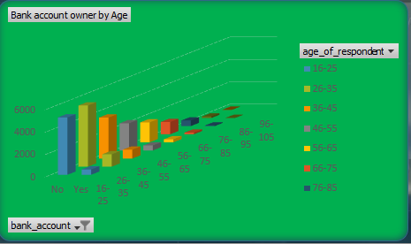
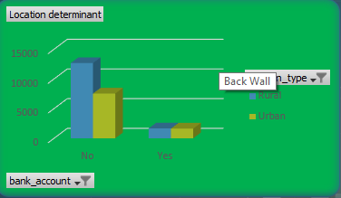
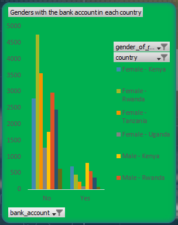
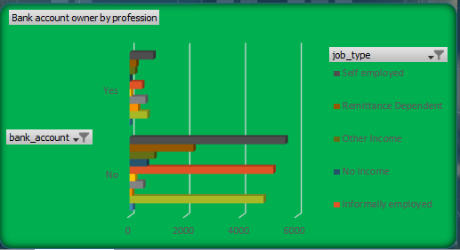
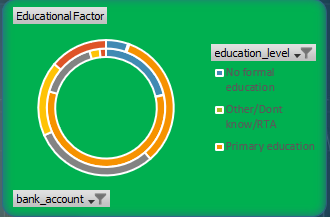
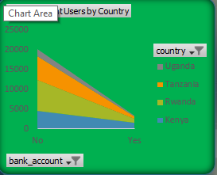

# Financial Inclusion in East Africa: Analysis & Insights

## Problem Statement
The purpose of this analysis is to understand financial inclusion in East Africa, specifically focusing on **bank account ownership**, **age distribution**, **urban vs. rural divide**, and **gender differences**, using survey data from three countries: **Tanzania, Kenya, and Uganda**.

This analysis explores relationships between bank account ownership, demographics, income source, and geographic location.

---

## Dataset Description
The dataset contains survey responses related to financial inclusion across East Africa, with the following key columns:

| **Column Name**          | **Description**                            |
|---------------------------|-----------------------------------------------|
| `country`                | Country (Kenya, Tanzania, Uganda)           |
| `year`                   | Year of survey response                     |
| `uniqueid`               | Unique identifier for each respondent       |
| `bank_acc`               | Whether the respondent has a bank account (`Yes/No`) |
| `location_type`          | Urban or Rural area classification           |
| `cellphone_access`       | Whether the respondent has access to a cellphone (`Yes/No`) |
| `household_size`         | Number of people in the respondent's household |
| `age_of_respondent`      | Age of the respondent                       |
| `gender_of_respondent`   | Gender of the respondent (`Male/Female`)   |
| `relationship_with_head`  | Relationship with household head            |
| `marital_status`          | Marital status of the respondent            |
| `education_level`         | Education level of the respondent           |
| `job_type`               | Type of employment or income source         |

---

## Visualization Representations

### **Dashboard Overview**

(financial-inclusion.png)

### 1. **Bank Account Ownership by Age Group**

#### Representation Insights:
- This visualization shows the proportion of individuals who own a bank account across various age groups for each country.
- Younger age groups and those transitioning into formal employment demonstrate varied levels of financial inclusion.

---

### 2. **Bank Account Ownership by Urban vs Rural Divide**

#### Representation Insights:
- The visualization breaks down bank account ownership patterns between **urban and rural areas** for Kenya, Uganda, and Tanzania.
- Urban areas show higher levels of financial inclusion compared to rural areas due to better infrastructure and access to banking services.

---

### 3. **Bank Account Ownership by Gender**

#### Representation Insights:
- This analysis examines the proportion of men and women who own a bank account in each country (Kenya, Uganda, Tanzania).
- Gender disparities in financial inclusion are evident, highlighting the need for inclusive banking reforms.

---
### 4. **Bank Account Ownership by Profession**

#### Representation Insights:
- This visualization shows how financial inclusion varies based on job type and profession.
- It differentiates individuals with bank accounts (`Yes`) vs. those without (`No`) across categories like **self-employed, remittance-dependent, and formal employment**.

---

### 5. **Education Level vs Financial Inclusion**

#### Representation Insights:
- Education levels impact financial literacy and inclusion. 
- Those with higher levels of formal education tend to have better access to financial tools like bank accounts.

---

### 6. **Country vs Financial Inclusion**

#### Representation Insights:
- Country-level trends show differences in financial inclusion rates across Kenya, Uganda, and Tanzania.
- Kenya leads in financial inclusion due to innovations like mobile banking, while Uganda and Tanzania are lagging, especially in rural areas.

---

## Insights

1. **Age & Financial Inclusion:**  
   Younger populations in East Africa exhibit varied financial inclusion rates, with financial inclusion rising significantly for individuals in their late twenties to early thirties. This suggests that financial behaviors are influenced by life stages, such as starting employment or families.  

2. **Urban vs Rural Divide:**  
   Financial inclusion is significantly higher in urban areas compared to rural areas due to better infrastructure, higher literacy levels, and proximity to financial institutions. However, the rural population remains underserved, which creates a gap in access to essential financial services.

3. **Gender Gap:**  
   There is a notable gender disparity in financial inclusion across Kenya, Tanzania, and Uganda, with women generally having lower bank account ownership rates than men. This disparity is often linked to systemic barriers such as lower access to education, income inequality, and cultural factors.

4. **Profession-Based Inclusion:**  
   Bank account ownership is highest among individuals in formal employment, followed by those who are self-employed. Individuals dependent on remittances or informal jobs have lower financial inclusion, which highlights the lack of financial products targeting these groups.

5. **Impact of Education:**  
   Higher education levels are directly correlated with increased financial inclusion. Respondents with secondary and tertiary education show a significantly higher likelihood of owning a bank account compared to those with only primary education or no formal education.

6. **Country-Level Trends:**  
   Kenya shows the highest level of financial inclusion among the three countries, likely due to the widespread adoption of mobile banking services such as M-Pesa. Tanzania and Uganda are catching up but still lag behind, especially in rural areas.

7. **Cellphone Access:**  
   Access to mobile phones is strongly linked to financial inclusion, as it facilitates mobile banking and digital transactions. However, the gap in cellphone ownership in rural areas limits the reach of such services.

8. **Household Size & Financial Behavior:**  
   Larger household sizes correlate with lower financial inclusion, likely due to resource constraints and competing financial priorities.

---

## Recommendations

1. **Expand Financial Literacy Programs:**  
   - **Target Women and Rural Communities:** Launch initiatives that educate women and rural populations about the importance of saving, borrowing responsibly, and using digital banking platforms.  
   - **Integrate Financial Education in Schools:** Incorporate basic financial literacy into school curriculums to encourage responsible financial behavior from a young age.  

2. **Promote Mobile Banking Solutions:**  
   - **Leverage Mobile Networks:** Partner with mobile service providers to expand mobile banking services, especially in rural areas.  
   - **Subsidize Smartphones:** Offer affordable smartphone programs to increase access to digital financial services.  

3. **Introduce Tailored Financial Products:**  
   - Develop financial products that cater specifically to informal workers and remittance-dependent households, such as micro-savings accounts and flexible credit schemes.  
   - Encourage banks to provide low-fee accounts to attract low-income earners and rural populations.  

4. **Address Gender Disparities:**  
   - **Incentivize Female Account Ownership:** Banks and financial institutions can offer incentives, such as reduced fees or targeted savings programs, to encourage women to open accounts.  
   - **Cultural Outreach Programs:** Work with local communities to address cultural barriers that prevent women from participating in financial systems.  

5. **Invest in Rural Infrastructure:**  
   - Build more banking agents or branch networks in rural areas to make banking services accessible.  
   - Partner with local cooperatives to encourage group savings and loans among rural populations.  

6. **Leverage Technology:**  
   - **Digitize Financial Services:** Encourage the development of digital wallets and payment systems to improve access and convenience.  
   - **Expand Internet Connectivity:** Invest in internet infrastructure to enhance access to online financial services in remote areas.  

7. **Government Policy & Collaboration:**  
   - Governments should work with banks and mobile service providers to create an enabling environment for financial inclusion.  
   - Develop regulations that promote fair access to financial services for underserved groups, such as women and rural populations.

---

## Project Repository
This repository hosts the analysis results, charts, and all findings related to the financial inclusion dataset analysis. Visualizations and insights are embedded for ease of access.

**Contributions:**  
If you would like to contribute or analyze further data insights, feel free to fork and submit a PR!

---

### Acknowledgments
Data from the financial inclusion survey across East African countries is used for analysis and insights.

---

🔗 **Find Data Visualization Charts in the Graphs Folder**

---

*The visualizations have been created with Excel.*

